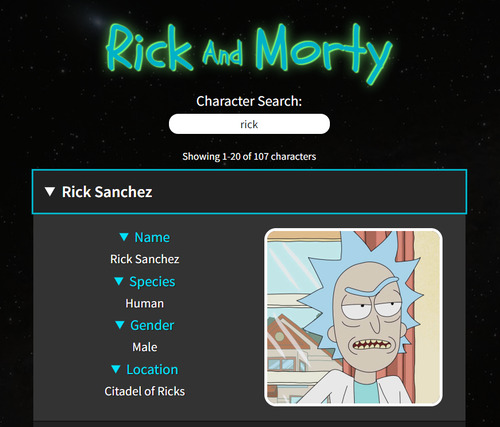

# Rick and Morty Character Search
This project demonstrates how React can be used to display character information fetched from the [Rick & Morty API](https://rickandmortyapi.com).

## Live Demo
A live demo is available on [CodePen](https://cdpn.io/erPRKg) and [Netlify](https://rick-and-morty-character-search.netlify.com/).

## License
This project is licensed under the MIT License - see the [license.md](license.md) file for details.